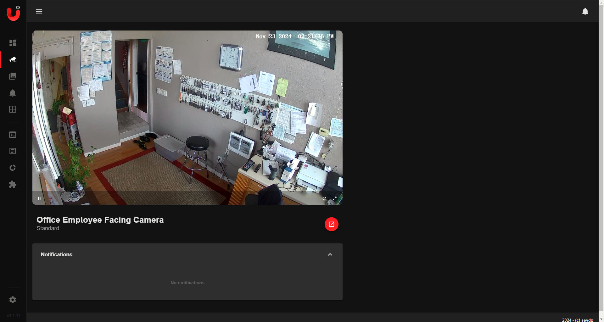

# Setting up Camera.UI on Docker for Windows


## Overview
This guide outlines the process for setting up **Camera.UI** on Docker for Windows. Camera.UI is a versatile NVR-like Progressive Web App (PWA) designed to manage RTSP-capable cameras. With features like live streams, motion detection, and notifications, it provides a robust solution for home automation and monitoring.

## Prerequisites

Before proceeding, ensure the following prerequisites are met:

- Docker Desktop is installed and running on your Windows system.
- Your RTSP-capable cameras are configured and accessible.
- Basic familiarity with Docker commands.
- Internet connectivity for pulling Docker images.

## Setup Steps

### Step 1: Pull the Camera.UI Docker Image
1. Open **Command Prompt** or **PowerShell**.
2. Pull the Docker image for Camera.UI:
   ```bash
   docker pull camera.ui-linux
   ```

### Step 2: Run the Container
Run the Camera.UI container using the following command:
```bash
docker run -d -p 8081:8081 --name camera-ui --restart unless-stopped camera.ui-linux
```
- **`-d`**: Runs the container in detached mode.
- **`-p 8081:8081`**: Maps the container’s port `8081` to the host’s port `8081`.
- **`--name camera-ui`**: Names the container `camera-ui`.
- **`--restart unless-stopped`**: Ensures the container restarts on system reboot or Docker daemon restarts.

### Step 3: Access the Web Interface
1. Open your browser and go to:
   ```plaintext
   http://localhost:8081
   ```
2. Log in with the default credentials:
   - **Username**: `master`
   - **Password**: `master`
3. Change your username and password immediately for security.

### Step 4: Configure Camera.UI
1. After logging in, go to the settings panel.
2. Add your RTSP-capable cameras:
   - Provide the RTSP stream URL for each camera.
   - Configure additional settings like motion detection, zones, or notifications.

### Step 5: Verify Restart Policy (Optional)
To ensure the container is set to restart automatically, verify the restart policy:
1. Run:
   ```bash
   docker inspect camera-ui | findstr RestartPolicy
   ```
   (For PowerShell, use `Select-String` instead of `findstr`).
2. Ensure the output includes:
   ```json
   "RestartPolicy": {
       "Name": "unless-stopped",
       "MaximumRetryCount": 0
   }
   ```

## Managing the Container
### Start and Stop
- **Start the container**:
  ```bash
  docker start camera-ui
  ```
- **Stop the container**:
  ```bash
  docker stop camera-ui
  ```

### View Logs
- To view the container logs:
  ```bash
  docker logs camera-ui
  ```

### Remove the Container
If you ever need to remove the container without losing your data, make sure your container's data is mapped to a persistent volume. Otherwise, you can remove the container with:
```bash
docker rm -f camera-ui
```

### Step 6: Update the Container
If a new version of Camera.UI is released, update the container as follows:
1. Stop and remove the existing container:
   ```bash
   docker stop camera-ui
   docker rm camera-ui
   ```
2. Pull the latest image:
   ```bash
   docker pull camera.ui-linux
   ```
3. Re-run the container with the same settings:
   ```bash
   docker run -d -p 8081:8081 --name camera-ui --restart unless-stopped camera.ui-linux
   ```

## Troubleshooting
### Common Issues
- **Port Conflict**: If port `8081` is already in use, choose another port:
  ```bash
  docker run -d -p 8082:8081 --name camera-ui --restart unless-stopped camera.ui-linux
  ```
  Access it via `http://localhost:8082`.

- **Logs Not Showing**: Use:
  ```bash
  docker logs camera-ui
  ```

- **Web Interface Not Accessible**: Ensure Docker Desktop is running and your firewall isn't blocking port `8081`.

### Error: `spawn ffmpeg ENOENT`
If you encounter an error related to `ffmpeg`:
1. Update the `Dockerfile` to install `ffmpeg`:
   ```dockerfile
   RUN apt-get update && apt-get install -y \
       curl \
       build-essential \
       nodejs \
       npm \
       ffmpeg \
       && apt-get clean
   ```
2. Rebuild and restart the container.

## Dockerfile for Camera.UI
```dockerfile
# Use a lightweight Debian base image
FROM debian:latest

# Set environment variables
ENV NODE_ENV=production
ENV NPM_CONFIG_PREFIX=/home/camerauser/.npm-global
ENV PATH=$PATH:/home/camerauser/.npm-global/bin

# Update and install necessary packages
RUN apt-get update && apt-get install -y \
    curl \
    build-essential \
    nodejs \
    npm \
    ffmpeg \
    && apt-get clean

# Install the correct Node.js version (20.x)
RUN curl -fsSL https://deb.nodesource.com/setup_20.x | bash - \
    && apt-get install -y nodejs

# Update npm to the latest version
RUN npm install -g npm@10.9.1

# Create a non-root user for security
RUN useradd -ms /bin/bash camerauser

# Install the camera.ui package globally
RUN npm install -g camera.ui@latest --unsafe-perm

# Set up directories and permissions for camera.ui
RUN mkdir -p /home/camerauser/.npm-global /home/camerauser/.camera.ui && \
    chmod 700 /home/camerauser/.camera.ui && \
    chown -R camerauser:camerauser /home/camerauser

# Set the working directory
WORKDIR /home/camerauser

# Expose the port for camera.ui
EXPOSE 8081

# Command to start camera.ui
CMD ["camera.ui", "--no-sudo", "--storage-path", "/home/camerauser/.camera.ui"]
```