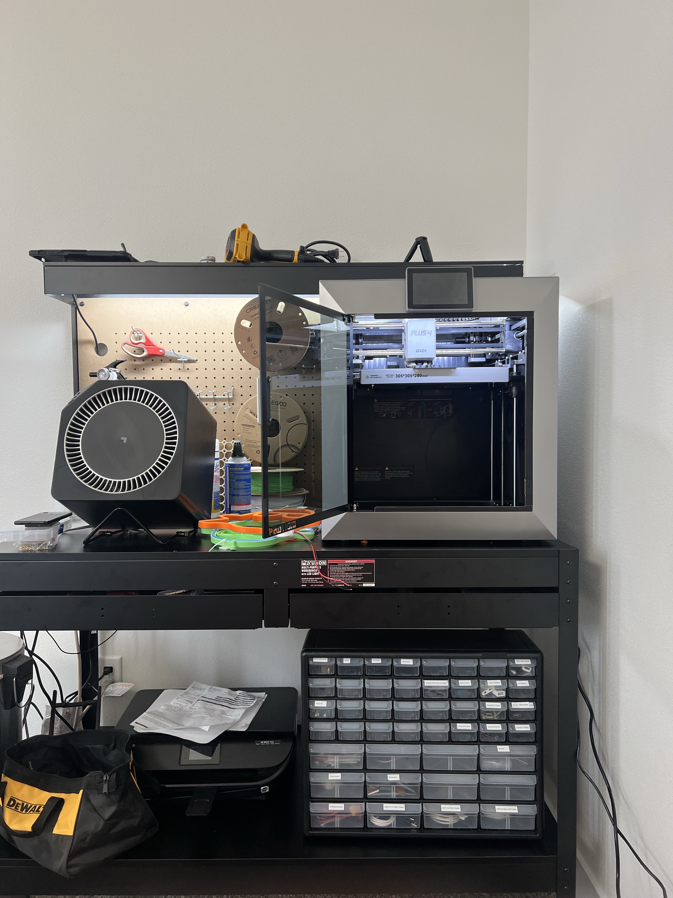
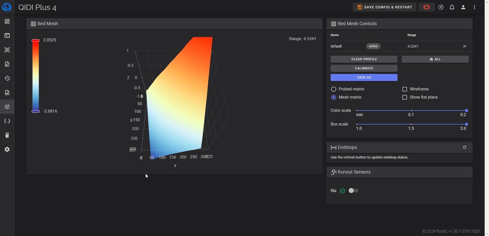
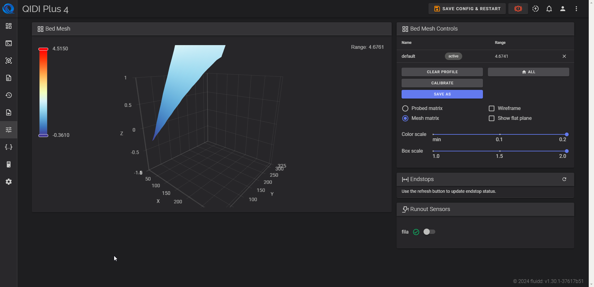
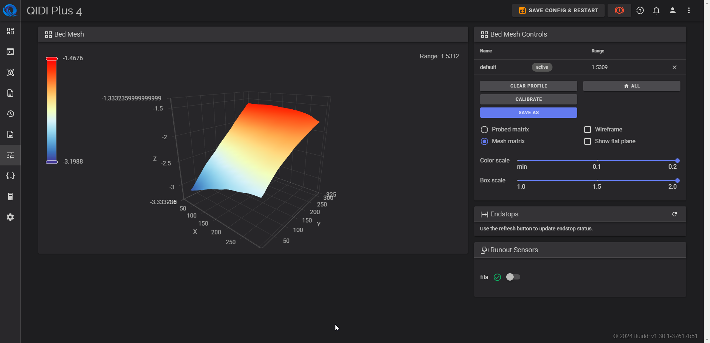
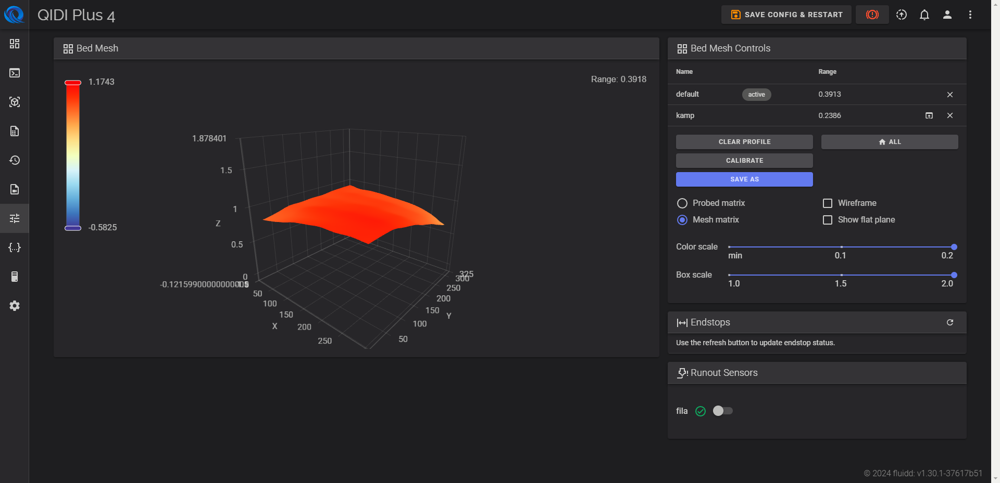

# QIDI Plus 4 Bed Mesh Correction Process

## Introduction

Upgrading from the [Ender 3 Pro](https://amzn.to/4esCpC9) to the [QIDI Plus 4](https://amzn.to/4f0itGN) was an exciting step forward, but it introduced me to a new component of 3D printing technology. Having never used Fluidd or Automatic Bed Leveling (ABL) before, I knew I had to experiment. The transition from manually leveling a print bed to utilizing these advanced tools posed a change, albeit a welcomed one. After several calibration attempts, adjustments, and refinements, I achieved an acceptable variance in the range of the bed mesh. In this article, I’ll walk you through the step-by-step process that transformed my bed mesh from highly uneven to leveled.

## The Initial Bed Mesh Reading

Upon starting the first calibration with Fluidd, the bed mesh data was clear—the bed was far from level. The **range** between the highest and lowest points was **4.5341**, with the lower end at **-2.6816** and the highest at **2.0525**. This much variance was causing severe print issues, including poor adhesion and inconsistent first layers.

## Step 1: First Adjustments and Hex Nut Corrections

I started by focusing on the **front right** and **back right** corners, the highest points on the bed. My first instinct was to **loosen** these hex nuts to bring the bed down in these areas. After running the ABL calibration, the mesh improved slightly, but the range was still significant, increasing slightly to **4.6741**.

Noticing the small improvement but the persistent issue, I realized I needed to focus on the **back left** corner, which was too low. I tightened this hex nut to raise that section of the bed.

## Step 2: Incremental Tightening and Loosening

With small adjustments to the hex nuts, I saw a real difference. Using a methodical approach, I turned each hex nut **25 degrees** at a time:

- I **tightened** the back right nut by four 25-degree turns to bring down the higher side.
- I then **loosened** the back left hex nut by two 25-degree turns to raise the lower corner.

These incremental adjustments began to close the gap, reducing the range between the high and low points and creating a more even bed. The bed mesh range was now at **1.5309**—a significant improvement from where I started.

## Step 3: Fine-Tuning the Bed Level

After each adjustment, I recalibrated the bed using Fluidd’s automatic bed leveling tool. The mesh had become much more balanced, but there was still room for improvement. I continued making small changes:

- I **tightened** the front left hex nut slightly to lower the high points.
- I continued **loosening** the back left hex nut to gradually raise the back left edge.

After each adjustment, I recalibrated and checked the bed mesh results to see how the bed was leveling out.

## Step 4: Achieving a Bed Mesh Range Under 0.5

After multiple rounds of precise tightening and loosening, the bed mesh finally reached a balanced state with a **range of 0.3913**. The highest point on the bed was **1.1743**, while the lowest was **-0.5825**. This marked a significant improvement from where I started, bringing the bed to an acceptable level. With a range under 0.5, the bed was now flat enough to provide a stable surface for consistent, high-quality prints.

## Conclusion

By methodically tightening the hex nuts using a socket wrench with a [15 mm hex socket](https://amzn.to/482xnK1)—**R** for tightening and **L** for loosening—and utilizing Fluidd’s automatic bed leveling tool to calibrate and check the bed mesh, I was able to greatly improve the levelness of my print bed. Achieving a balanced mesh allows for a consistent first layer, solving many of the adhesion and printing issues I had encountered earlier. Though the process requires time and attention, fine-tuning the bed level is essential for successful prints when using ABL technology. With patience and persistence, anyone can achieve a perfectly leveled bed mesh on their 3D printer.
