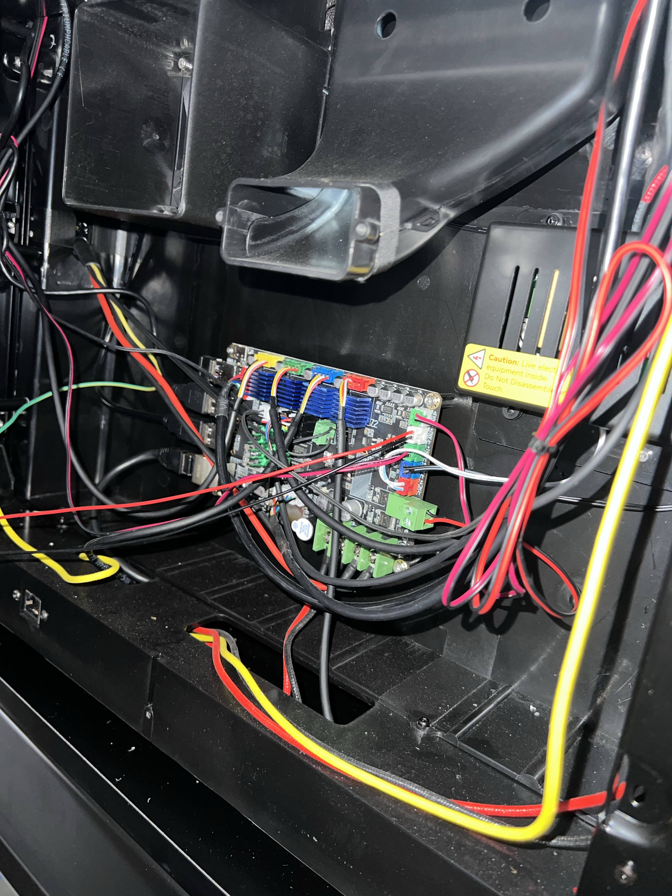
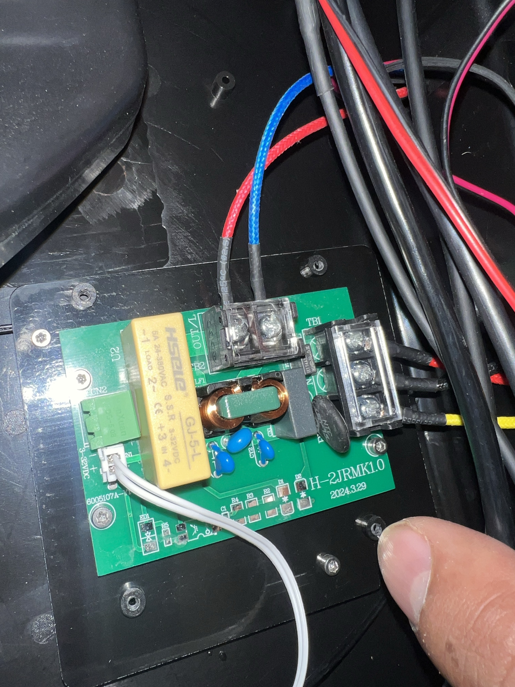

# QIDI Plus 4 Winter Redemption Arc – Removing Back Panel and SSR Check Update

## Introduction

Yesterday I heard back from QIDI Tech support regarding the issues I've been facing with my QIDI Plus 4 3D printer. I want to start by thanking everyone who responded to my post yesterday regardeless of the tone of the response. I appreciate the concern and harmony in the community. I also want to apologize for any confusion caused by my previous posts. I understand that my initial posts may have caused some alarm, and I want to clarify that my intention was to share my experience and raise awareness about potential safety concerns with the QIDI Plus 4. I did not intend to spread fear or misinformation, and as such I have removed by previous post and also provided images of the back panel removal and SSR check process.

## The Back Panel Removal Process

I removed the back panel of the QIDI Plus 4 to access the Solid State Relay (SSR) board and inspect it for any signs of damage or overheating. The process was straightforward, requiring only a few tools and careful handling to avoid damaging any components. Here are the steps I followed to remove the back panel:

1. **Power Off and Unplug**: Before starting, I powered off the printer and unplugged it from the power source to ensure safety.
2. **Remove the Screws**: Using an Allen key, I removed the screws holding the back panel in place. 
3. **Gently Pull the Panel**: With the screws removed, I gently pulled the back panel away from the printer to expose the internal components.
4. **Inspect the SSR Board**: Once the panel was removed, I carefully inspected the main board for any signs of discoloration, burning, or damage.
5. **Remove SSR Cover and Check**: I removed the SSR cover and checked the SSR board for any visible signs of overheating or damage.
6. **Reassemble the Printer**: After inspecting the SSR board, I reassembled the printer by carefully replacing the SSR cover, back panel and securing it with their respective screws.

## The SSR Check Results

After inspecting the SSR board, I found no visible signs of damage or discoloration. However there is still a lingering smell of burnt plastic which I have reported to QIDI Tech support back on October 11, 2024 however, I'm not able to determine which component is causing the smell. I will keep you updated on any further developments.
  

  
## Conclusion

I want to thank the community for their support and understanding as I navigate these issues with my QIDI Plus 4. I will continue to provide updates on my progress and any further actions I take to address the safety concerns and usability issues with the printer. 