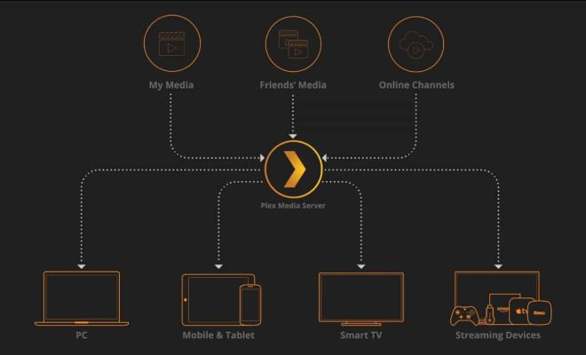

# Review of Sources for Management Investigation Report on Implementing Effective Management Practices for Home Media Servers

## Overview of Home Media Server Management

When setting up a home media server, two aspects of the device which will be managing the media server are crucial: the power usage and processing power. The latest Raspberry Pi single-board computer, Raspberry Pi 5, is two to three times faster than its predecessors, with a power consumption of 25 watts (Kofler, 2024). 
  

(KL, 2024)

  
Its computing power, small size and low price make the Raspberry Pi SBC an ideal choice for projects, including building an at-home media service that provides on-demand access to movies, music, and other media content over the internet (KL, 2024). Popular media-streaming software like Kodi, Plex, Emby and Jellyfin can be used to stream your media content to various devices, including smart TVs, streaming boxes such as Apple TV, Chromecast and Amazon Fire TV, and mobile devices (Parkyn, 2018).

## Open Source Media Server Software

After Kodi became associated with piracy, Plex emerged as a popular alternative for managing media content (Parkyn, 2018). However, we've seen key features in Plex being locked behind a paywall. Jellyfin follows the same server-client model as Plex which allows for streaming content over your network but with an added focus on privacy and open-source software (Peers, 2022). Not only that, Jellyfin can easily be run on a Raspberry Pi 3 or later models (Peers, 2020).

## Media Management and Automation

Tools like Radarr, Sonarr, Prowlarr and QBittorrent can help with automating media managment on your server. By implementing these tools, you can automate the process of downloading, organizing, and streaming media content to your devices. Radarr and Sonarr are used for managing movies and TV shows, respectively, while Prowlarr acts as a proxy for accessing private torrent trackers. QBittorrent is a lightweight torrent client that can be used to download media content from various sources (Gupta, 2022).

## Conclusion

The Raspberry Pi 5 is more than capable of running Jellyfin and with services like Radarr, Sonarr, Prowlarr and QBittorrent, you can automate the process of managing your media content. This creates an experience like Over The Top (OTT) third-party services such as Netflix and Hulu, but with the added benefit of privacy and control over your media library.

