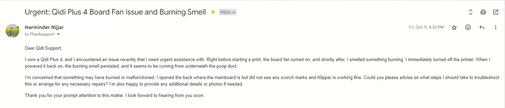

# QIDI Plus 4 SSR Issues and Request for Replacement or Refund

## Introduction

I purchased the QIDI Plus 4 3D printer from their official website on September 24, 2024 and received it on September 30, 2024. I was excited to upgrade from my Ender 3 Pro and explore the new features and capabilities of the QIDI Plus 4. I've printed primarily PLA with some PETG and TPU on the Ender 3 Pro and was looking forward to the enhanced printing experience with the QIDI Plus 4.However on October 11, 2024, I encountered a burning smell coming from the printer which seemed to be originating from underneath the poop duct. I immediately turned off the printer and unplugged it to prevent any further damage. I contacted QIDI Tech support and heard back from them a few days later.
  

  
In my eagerness and wanting to get back to printing, I side-stepped the issue and continued printing letting support know that the smell had dissipated. However, on November 1, the Plus 4 ran into an issue with the extruder not heating at all. I contacted support again have been waiting for a response since then.

## The Primary Issue

### Burning Smell

The burning smell issue and potential safety risks associated with the QIDI Plus 4 have raised significant concerns. After investigating online forums and user-reported issues, I discovered a PSA that highlighted serious safety flaws with the printer’s Solid State Relay (SSR) board responsible for the chamber heater. A video posted on YouTube by a concerned user, along with a stream by Grant from 3D Musketeers, indicated that the chamber heater and SSR board were prone to overheating due to design flaws and potential voltage mismatches.
  

    <iframe width="560" height="315" src="https://www.youtube.com/embed/JARwXIiTbxM?si=E4jUanC3S4thZ_0k" title="YouTube video player" frameborder="0" allow="accelerometer; autoplay; clipboard-write; encrypted-media; gyroscope; picture-in-picture; web-share" referrerpolicy="strict-origin-when-cross-origin" allowfullscreen></iframe>

 
Specifically, users reported the SSR board drawing more power than its rated capacity, which in some cases exceeded 500 watts, causing discoloration and burning on components around the heater’s coils. These findings suggest that the printer could pose a fire hazard if left unaddressed, especially for users on 120-volt systems where incorrect configurations reportedly result in excess current through the SSR board​

## Secondary Issue

### Extruder Heating Failure

The extruder heating failure on November 1, 2024, further compounds the safety concerns and usability issues with the QIDI Plus 4. The inability to heat the extruder prevents the printer from functioning correctly, rendering it unusable for its intended purpose. The sudden failure of a critical component like the extruder raises questions about the printer’s reliability and long-term performance. Given the safety risks associated with the SSR board and the extruder heating failure, it is evident that the QIDI Plus 4 has significant design or manufacturing flaws that need to be addressed promptly.

## The Request

### Replacement or Refund

Given the safety concerns and the printer’s inability to function properly, I am going to be requesting a replacement or a refund for the QIDI Plus 4. The issues encountered, including the burning smell and extruder heating failure, indicate a fundamental flaw in the printer’s design or manufacturing process. As a customer, I expect a reliable and safe product that meets the advertised specifications and quality standards. The safety risks associated with the SSR board and the potential for fire hazards are unacceptable, and I cannot continue using the printer in its current state.
